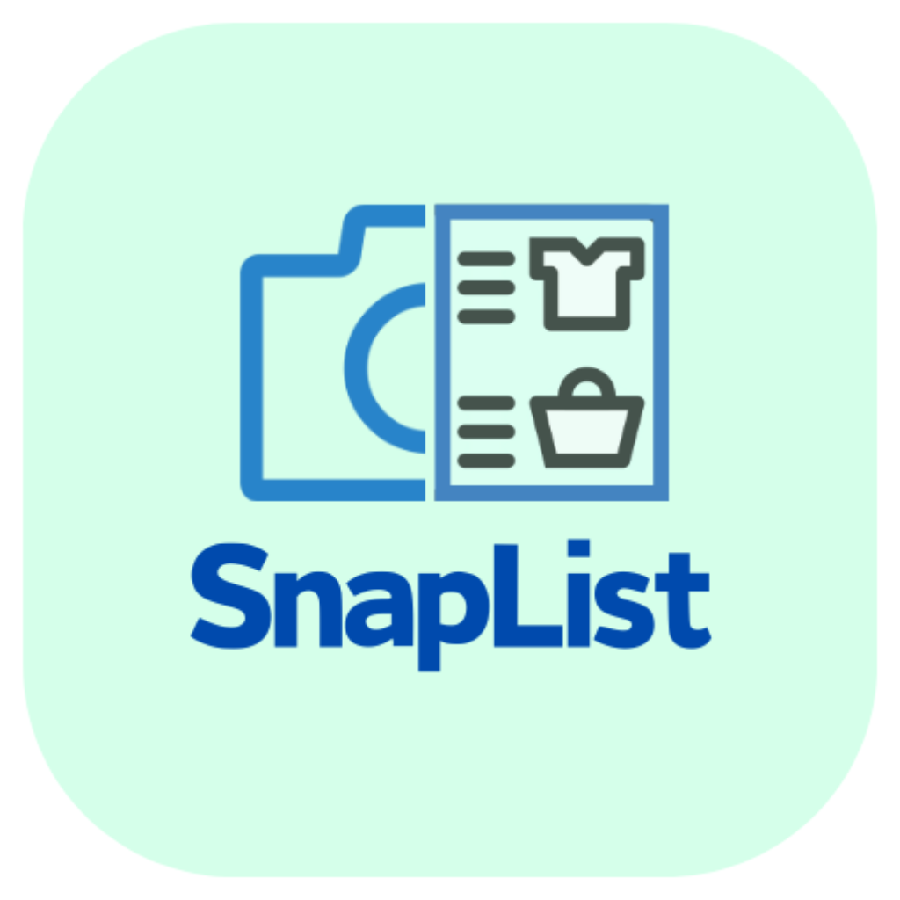

<h1 align="center">
  <br/>
Mobile App </h1>

> This Project is based on [Obytes starter](https://starter.obytes.com)

## Requirements

https://shipmobilefast.com/asset-generator

- [React Native dev environment ](https://reactnative.dev/docs/environment-setup)
- [Node.js LTS release](https://nodejs.org/en/)
- [Git](https://git-scm.com/)
- [Watchman](https://facebook.github.io/watchman/docs/install#buildinstall), required only for macOS or Linux users
- [Pnpm](https://pnpm.io/installation)
- [VS Code Editor](https://code.visualstudio.com/download) ⚠️ Make sure to install all recommended extension from `.vscode/extensions.json`

## 👋 Quick start

Clone the repo to your machine and install deps :

```sh
git clone https://github.com/user/repo-name

cd ./repo-name

pnpm install
```

To run the app on ios

```sh
pnpm ios
```

To run the app on Android

```sh
pnpm android
```

## ✍️ Documentation

- [Rules and Conventions](https://starter.obytes.com/getting-started/rules-and-conventions/)
- [Project structure](https://starter.obytes.com/getting-started/project-structure)
- [Environment vars and config](https://starter.obytes.com/getting-started/environment-vars-config)
- [UI and Theming](https://starter.obytes.com/ui-and-theme/ui-theming)
- [Components](https://starter.obytes.com/ui-and-theme/components)
- [Forms](https://starter.obytes.com/ui-and-theme/Forms)
- [Data fetching](https://starter.obytes.com/guides/data-fetching)
- [Contribute to starter](https://starter.obytes.com/how-to-contribute/)

Site URL: exp://localhost:19000
Redirect URLs:

- exp://localhost:19000/auth/callback
- com.snaplist.development://

<!-- STAGING -->

Site URL: exp://exp.host/@martinki/snaplist
Redirect URLs:

- com.snaplist.staging://auth/callback
- exp://exp.host/@martinki/snaplist/auth/callback

<!-- PRODUCTION -->

Site URL: [Your production URL]
Redirect URLs:

- com.snaplist://auth/callback
- [Your production domain]/auth/callback
